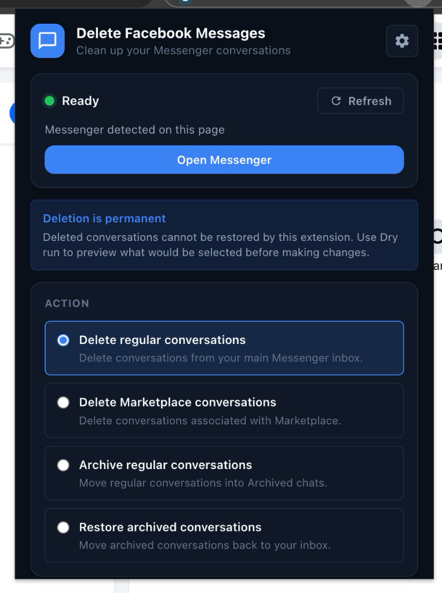

# Delete Facebook Messages

A small, open-source Chrome extension for managing Facebook Messenger conversations from a simple control panel.

Preview what will happen first, then delete, archive, or restore conversations when you're ready.

[](LICENSE)
[](manifest.json)

<p align="center">
  
</p>

## What you can do

- **Delete regular conversations** from your Messenger inbox.
- **Delete Marketplace conversations** separately from regular chats.
- **Archive conversations** instead of deleting them.
- **Restore archived conversations** back to your inbox.
- **Preview actions with Dry run** before anything is changed.
- **Limit each run** to a specific number of conversations.
- **Choose a slower or faster delay** between actions.
- **Stop an active run** after the current action finishes.
- Use the popup in **System, Light, or Dark** mode.

## Safety first

Deleting a conversation is permanent from this extension's point of view. There is no undo button after Messenger confirms the deletion.

For a first run, we strongly recommend:

1. Turn on **Dry run — preview only**.
2. Enable **Limit conversations** and start with a small number such as `1` or `5`.
3. Confirm the extension is selecting the conversations you expect.
4. Disable Dry run only when you're comfortable with the result.

The extension includes a second confirmation step before an actual delete begins.

## Install

### Chrome Web Store

The current open-source version has **not yet been republished to the Chrome Web Store**.

For now, install the extension from source using the steps below. When a new Chrome Web Store listing is published for this project, this README can link to that new listing.

### Install from source

If you want to run the latest code directly from GitHub:

```bash
git clone https://github.com/andrewtryder/chrome-delete-facebook-messages.git
cd chrome-delete-facebook-messages
npm ci
npm run build
```

Then in Chrome:

1. Open `chrome://extensions`.
2. Enable **Developer mode**.
3. Click **Load unpacked**.
4. Select the generated `dist/prod` folder.

`dist/prod` is the production build. `dist/dev` also allows the local Messenger test fixture and is intended for development only.

## Quick start

1. Open **Facebook Messenger** in Chrome.
2. Click the **Delete Facebook Messages** extension icon.
3. Wait for the status to show **Ready**.
4. Choose an action:
   - Delete regular conversations
   - Delete Marketplace conversations
   - Archive regular conversations
   - Restore archived conversations
5. Turn on **Dry run** if you want a preview first.
6. Optionally enable a conversation limit.
7. Click the main action button.
8. For real deletions, review the confirmation and confirm only when you're ready.

You can press **Stop** while a run is active. The extension stops after the current action completes.

## Privacy

The extension is designed to do its work locally in your browser.

- It does **not** send message content to an external server.
- It does **not** collect conversation names, message text, thread URLs, or Facebook IDs for analytics.
- The Activity view stores only small aggregate run statistics such as processed, inspected, skipped, and error counts.
- Preferences such as theme, Dry run defaults, limits, and action delay are stored locally with Chrome extension storage.

The extension uses the `tabs` and `storage` Chrome permissions and runs its content script only on Facebook and Messenger pages in the production build.

## How it works

This extension automates the Messenger interface you already see in the browser. It does not use a private Facebook API to delete your conversations.

For each matching conversation, it finds Messenger's visible controls, opens the appropriate menu, selects the requested action, and handles the confirmation flow when required.

Because Facebook can change its interface at any time, a Messenger redesign can temporarily break selectors or navigation. Dry run exists partly to help catch those changes before a destructive operation.

## Troubleshooting

**The popup says “Messenger not detected.”**<br>
Open `facebook.com/messages` or `messenger.com`, then click **Refresh** in the extension.

**The extension says the content script is unavailable.**<br>
Reload the Messenger tab after installing or updating the extension, then try again.

**An action stops or Messenger looks different.**<br>
Facebook may have changed its interface. Try a Dry run first and, if the problem continues, [open an issue](https://github.com/andrewtryder/chrome-delete-facebook-messages/issues/new).

**I only want to test one conversation.**<br>
Enable **Limit conversations** and set the limit to `1`.

## Development

The project includes a privacy-safe local Messenger fixture, native unit tests, Playwright browser tests, and full Manifest V3 extension E2E coverage.

```bash
# Run everything
npm test

# Unit tests only
npm run test:unit

# Local fixture tests
npm run test:fixture

# Real MV3 extension E2E tests against the local fixture
npm run test:e2e

# Build production and development extension packages
npm run build
```

To work with the local Messenger fixture:

```bash
npm run serve:fixture
```

See [CONTRIBUTING.md](CONTRIBUTING.md) for development conventions, release workflow, fixture capture details, and Conventional Commit guidance.

## Contributing

Issues and pull requests are welcome.

If Facebook changes Messenger and an action stops working, a clear issue report is especially helpful. Please include:

- what action you selected,
- whether Dry run was enabled,
- what you expected to happen,
- what actually happened,
- and any non-sensitive console error text that may help diagnose the problem.

Please do **not** post message contents, conversation names, account IDs, cookies, tokens, or other private Facebook data in an issue.

## Disclaimer

This project is an independent open-source utility and is not affiliated with, endorsed by, or sponsored by Meta or Facebook.

Use bulk deletion carefully. You are responsible for reviewing what the extension will act on before confirming destructive operations.

## License

Released under the [MIT License](LICENSE).
